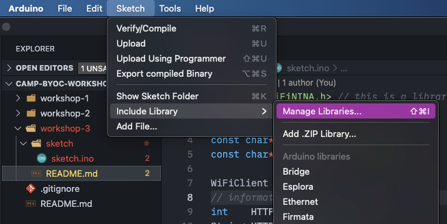
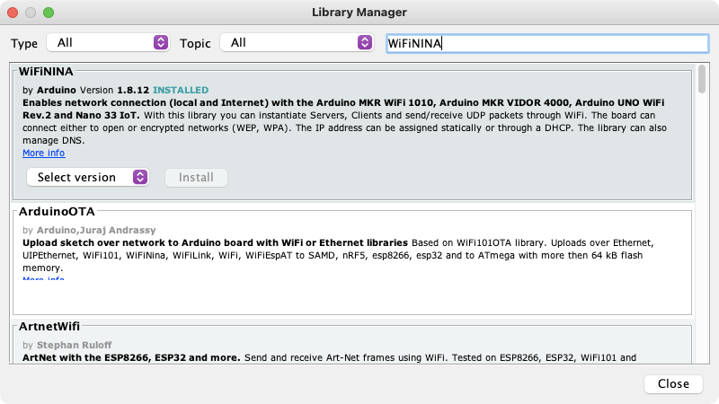

# Workshop #3 - Internet Button

First I want to show you what we'll be doing!

We're adding _a lot_ of code on top of what we added in Workshop 2. So, let's talk about it!

## Let's add a Library

```cpp
#include <WiFiNINA.h> // this is a library that helps us connect to the internet!
```

As the comment says, this is a library that we're using to help us connect to the internet. Here's how to add this library:

1. In the Arduino IDE, go to Sketch, then Add Library, then at the top click Add Library


2. In the window that opens, type in the search bar "WiFiNINA" and click Install on the top one.


## New Code

```cpp
// WiFi credentials.
const char* WIFI_SSID = "SSID";
const char* WIFI_PASS = "Password";

WiFiClient client;
// information for HTTP Request
int    HTTP_PORT   = 80;
String HTTP_METHOD = "POST";
char   HOST_NAME[] = "triggers.losant.com";
String PATH_NAME   = "/webhooks/bEaAdLGfpr97Iw8O4r1vWx2n_OUxoOvWmTrvM2mL";

// Edit these values to change the Name and Message that you send to the Light Wall!
char NAME[] = "your-name-here";
char MESSAGE[] = "Hello, World!";
```

This bit of code defines the parameters for connecting to the internet. It also is the place where we define where we're going to be sending to the Light Wall.

```cpp
void connect() {

  // Connect to Wifi.
  Serial.print("Connecting to ");
  Serial.println(WIFI_SSID);

  WiFi.begin(WIFI_SSID, WIFI_PASS);

  while (WiFi.status() != WL_CONNECTED) {
    delay(500);
    Serial.print(".");
  }


  Serial.println("");
  Serial.println("WiFi connected");
  Serial.println("IP address: ");
  Serial.println(WiFi.localIP());

}
```

This is a new function that we're adding that connects to the internet. You can see, in the `setup()` function, that we've called this function to be executed when the device turns on!

```cpp
void makeHTTPRequest() {

  // build HTTP Body
  char buffer[1024];
  sprintf(buffer, "{ \"name\": \"%s\", \"message\": \"%s\" }", NAME, MESSAGE);
  String postMessage = buffer;
  
  Serial.println("Connecting to Server...");
  if (client.connect(HOST_NAME, HTTP_PORT)) {
    // if connected:
    Serial.println("Connected to server");
    // make a HTTP request:
    // send HTTP header
    client.println(HTTP_METHOD + " " + PATH_NAME + " HTTP/1.1");
    client.println("Host: " + String(HOST_NAME));
    client.println("Content-Length: " + String(postMessage.length(), DEC));
    client.println("Content-Type: application/json");
    client.println("Connection: close");
    client.println(); // end HTTP header

    // send HTTP body
    Serial.println(postMessage);
    client.println(postMessage);

    long time = millis();
    while (client.connected() && millis() - time < 5000) {
      if (client.available()) {
        // read an incoming byte from the server and print it to serial monitor:
        char c = client.read();
        Serial.print(c);
      }
    }

    // the server's disconnected, stop the client:
    client.stop();
    Serial.println();
    Serial.println("disconnected");
  } else {// if not connected:
    Serial.println("connection failed");
  }
}
```

Alright, that's a lot. But, this function, as its name suggests, is making the HTTP request to the website to send your information to the Light Wall. You can see, in the `loop()` function, that we call this function when the button is pressed.

## Edit the Code

Just like you did for workshops 1 and 2, copy and paste this code in. We do, though, have to make a few changes:

1. On lines 4 and 5 where we have `WIFI_SSID` and `WIFI_PASS`, we need to add the WiFi Credentials:
    - **SSID**:
    - **Password**:

2. On lines 15 and 16, change `NAME` to your name and `MESSAGE` to a message you'd like to see on the Light Wall.

Finally, once you've put the WiFi information in and have upated the name and message to your own name and a new message, you can flash this firmware to your device.

Once you flash your device, you can open the Serial Monitor by going to Tools and then clicking Serial Monitor.

When you see "WiFi Connected" you can press the button. The LED should still toggle on, and then you should see your name and message on the Light Wall!
